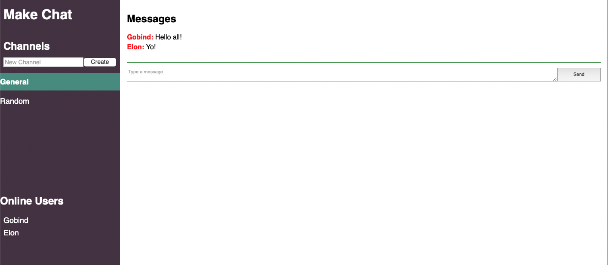

# Make-Chat

This is a Node.js project based on the [Make Chat tutorial](https://makeschool.org/mediabook/oa/tutorials/make-chat/start-slacking/). This project is a live messaging application (like Slack and Discord) built using the [socket.io](https://socket.io) library to implement websockets.

Demo:
